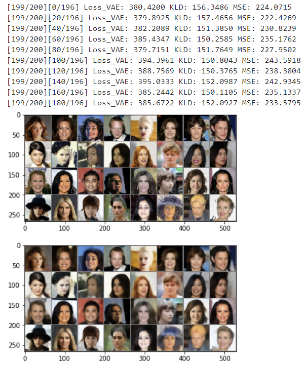

This repository is forked from [dcgan_vae_pytorch](https://github.com/seangal/dcgan_vae_pytorch/).
I study this by reading and commenting.

# dcgan_vae_pytorch
dcgan combined with vae in pytorch!

this code is based on [pytorch/examples](https://github.com/pytorch/examples) and [staturecrane/dcgan_vae_torch](https://github.com/staturecrane/dcgan_vae_torch)

The original artical can be found [here](https://arxiv.org/abs/1512.09300)
## Requirements
* torch
* torchvision
* visdom
* (optional) lmdb

## Usage
to start visdom:
```
python -m visdom.server
```


to start the training:
```
usage: main.py [-h] --dataset DATASET --dataroot DATAROOT [--workers WORKERS]
               [--batchSize BATCHSIZE] [--imageSize IMAGESIZE] [--nz NZ]
               [--ngf NGF] [--ndf NDF] [--niter NITER] [--saveInt SAVEINT] [--lr LR]
               [--beta1 BETA1] [--cuda] [--ngpu NGPU] [--netG NETG]
               [--netD NETD]

optional arguments:
  -h, --help            show this help message and exit
  --dataset DATASET     cifar10 | lsun | imagenet | folder | lfw
  --dataroot DATAROOT   path to dataset
  --workers WORKERS     number of data loading workers
  --batchSize BATCHSIZE
                        input batch size
  --imageSize IMAGESIZE
                        the height / width of the input image to network
  --nz NZ               size of the latent z vector
  --ngf NGF
  --ndf NDF
  --niter NITER         number of epochs to train for
  --saveInt SAVEINT     number of epochs between checkpoints
  --lr LR               learning rate, default=0.0002
  --beta1 BETA1         beta1 for adam. default=0.5
  --cuda                enables cuda
  --ngpu NGPU           number of GPUs to use
  --netG NETG           path to netG (to continue training)
  --netD NETD           path to netD (to continue training)
```

_ここからは追加分_

## dataset

- [Body-parts dataset list](https://github.com/arXivTimes/arXivTimes/blob/a51bfe64a3862e4cceafa3863b777f473f6c0900/datasets/README.md#bodyparts)
- [IMDb-face](https://github.com/fwang91/IMDb-Face)
- [IMDb-face download script](https://github.com/IrvingShu/IMDb-Face-Download)

### aditional info - Asian facial image dataset

[Can anyone help me find a database with asian faces?](https://www.researchgate.net/post/Can_anyone_help_me_find_a_database_with_asian_faces)
- [The Asian Face Age Dataset (AFAD)](https://afad-dataset.github.io/)
- [CASIA-FaceV5](http://biometrics.idealtest.org/dbDetailForUser.do?id=9)

## requirements

- pytorch　1.3.0 or 1.3.1
- torchvision　0.4.2
- argparse
- visdom
visdomはrequest2.2.0が必要なので環境を作る時に注意すること  
※argparse とvisdomは今回は使っていない。

それでも問題が起こるようならばcondaをupdateする
[RemoveError: 'pyopenssl' is a dependency of conda and cannot be removed from conda's operating environment.が出た時にやったこと メモ](https://knaka20blue.hatenablog.com/entry/2019/02/25/131937)
conda update --force conda

## train by MNIST


- 入出力画像サイズ32
- 潜在空間の次元100
- バッチサイズ256
- エポック数200
- 学習率0.0002、最適化関数Adam

VAE errorはおおよそ50前後で収束。

### jpegデータの取得方法
[手書き数字MNISTのjpgファイル群をダウンロードする方法](https://i-doctor.sakura.ne.jp/font/?p=20494)

要はKaggleからダウンロードしてくる、ということ。

### 気になったこと
よく見かけるMNISTのVAEの実装では、decoderの最後の活性化関数にSigmoidが使われる。
- [PyTorch (11) Variational Autoencoder](http://aidiary.hatenablog.com/entry/20180228/1519828344)
- [【超初心者向け】VAEの分かりやすい説明とPyTorchの実装](https://tips-memo.com/vae-pytorch)

しかし、今回は元のコードに従ってTanhとした。Sigmoidにすると黒のピクセルがグレーになってしまったため。

## train by celebA




- 入出力画像サイズ64
- 潜在空間の次元512
- バッチサイズ256
- エポック数200
- 学習率0.0002、最適化関数Adam

VAE errorはおおよそ400前後で収束。  
celebAは計算速度の都合上、AWSのp2.xlargeを使った。  
p2.xlarge16も試してみたが、GPUの並列化がうまくいかなかったため断念した。

- [PyTorch で GPU 並列をちょっと詳しく](https://nomoto-eriko.hatenablog.com/entry/2019/06/03/174633)

なお、AWSに用意されているDeepLearning AMIにはPyTorch, Kras, TensorFlowが入っており、Jupyterも標準でインストールされているため、GPUインスタンスを使う際にほとんど環境設定しなくても良い。非常に便利。


### celebAの画像データをwgetする
celebAのデータはGoogle Driveで公開されている。Windowsなどで利用する場合にはそのままダウンロードすれば良いが、Linuxでデータを持ってくるにはちょっと手間がかかる。下記リンク先を参照。

- [curlやwgetで公開済みGoogle Driveデータをダウンロードする](https://qiita.com/namakemono/items/c963e75e0af3f7eed732)

```
curl -sc /tmp/cookie "https://drive.google.com/uc?export=download&id=0B7EVK8r0v71pZjFTYXZWM3FlRnM" > /dev/null
CODE="$(awk '/_warning_/ {print $NF}' /tmp/cookie)"  
curl -Lb /tmp/cookie "https://drive.google.com/uc?export=download&confirm=${CODE}&id=0B7EVK8r0v71pZjFTYXZWM3FlRnM" -o img_align_celeba.zip
```

これでいける。

### 気になったこと
- Windows上ではdataloaderのworkerを0にしないと正常に動作しなかったが、AWSでは任意の整数で動作する。GPUのパフォーマンスにも影響するので、AWSで実行する場合にはworkerの数を適切に設定するのを忘れないこと。
- コード全般にかかわることだが、損失関数のMSECriterion = nn.MSELoss()はこのままでは正常に動作しない。MSECriterion = nn.MSELoss(reduction = 'sum')としてバッチ毎のlossの合計を出すようにしないと、適切に学習が進まないようだ。なお、MSELossのデフォルトはmeanだそうな。

## AWSの環境設定

すでに述べたように、今回はAWSのGPUインスタンスであるp2.xlargeを使用している。サーバ構築時にDeepLearning AMIを用いた。そのため、環境設定はほぼ不要である。Jupyterを使う場合にのみ、以下の設定が必要となる。

[AWSにpythonとjupyter labをさっくり導入する](http://wanko-sato.hatenablog.com/entry/2018/09/09/163043)

こちらを参照。

```
jupyter notebook --generate-config
vi ~/.jupyter/jupyter_notebook_config.py
```

とし、configに以下のように書き込む。

```
c.NotebookApp.ip = '*'
c.NotebookApp.open_browser = False
c.NotebookApp.port = 8890
c.NotebookApp.password = ''
```

passwordを空のままとしておき、

```
python -c "import IPython;print(IPython.lib.passwd())"
```

として出力されるsha1:xxxxxx...を後で書き込む。
これでJupyterにポート8890でパスワードログインできるようになる。
次に、jupyter-labの自動起動の設定を行う。

```
which jupyter-lab
```

でjupyter-labのフルパスを取得。

```
touch ~/start_jupyter.sh
chmod 777 ~/start_jupyter.sh
```

としてstart_jupyter.sh を作りフルパスを書き込む。

```
sudo vi /etc/rc.local
```

exit 0の前にsu - ubuntu /home/ubuntu/start_jupyter.sh &を書き込んで保存終了。  
再起動してjupyter-labに入れるかどうか確認する。
